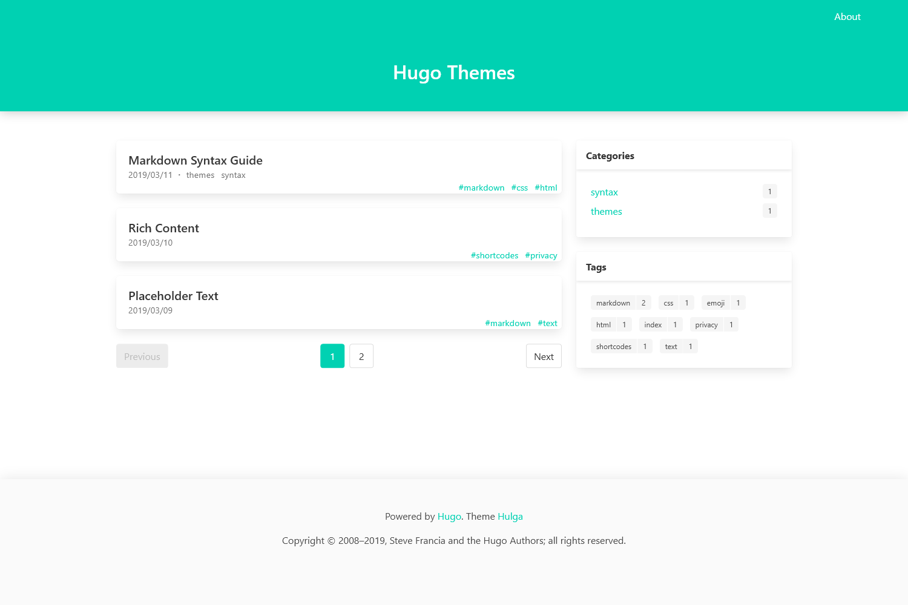

# hugo-theme-hulga

> hugo + bulma = hulga

## Screenshot

build `hugoBasicExample` without any config of this theme



## Demo

build hugo site with configs

[Demo site](https://v4.zilch40.wang)

[My Blog](https://blog.zilch40.wang)

## Features

- small & fast
- basic functions:
  - category list&term pages
  - tag list&term pages
  - archives pages
- TOC sidebar
- `prefers-color-scheme` media support
- PWA support

## Install

1. clone to hugo site themes folder

```bash
git submodule add https://github.com/wlh320/hugo-theme-hulga.git themes/hulga
```

2. enable it in `config.toml`

```
theme = "hulga"
```
and then config it.

3. to use `postcss`, copy `package.json ` and `postcss.config.js` to the root of your site folder, then `npm install`

## Config

An example of avaliable params:

```toml
baseURL = "https://example.com"
languageCode = "zh-cn"
DefaultContentLanguage = "zh-cn"
title = "My New Hugo Site"
paginate = 10
theme = "hulga"

[params]
  # change bulma's primary color
  primaryColor = "#1793d0"

  # subtitle on homepage
  subtitle = "This is a subtitle"

  # copyright text on footer
  copyright = "Copyright © 2020 wlh. All rights reserved."

  # enable katex rendering
  math = true

  # enable postcss, mainly for css purge (129kB->20kB->4.8kB gzipped, but this makes build slower)
  postcss = true

  # enable toc on post page
  toc = true

  # enable TOC auto collapse
  autoCollapseToc = true

  # enable prefers-color-scheme:dark
  darkMedia = true

  # enable hero section's is-bold effect
  heroBold = true

  # enable PWA, prepare your icons and DON'T forget to modify manifest.json
  pwa = true

# to enable different hightlight themes in light/dark mode 
[markup]
  [markup.highlight]
    noClasses = false

[menu]
  [[menu.main]]
    identifier = "index"
    name = "首页"
    url = "/"
    weight = 1
  [[menu.main]]
    identifier = "archives"
    name = "归档"
    url = "/archives/"
    weight = 2
  [[menu.main]]
    identifier = "about"
    name = "关于"
    url = "/about/"
    weight = 3

[taxonomies]
category = "categories"
tag = "tags"

```

## Acknowledgement

本项目的诞生离不开以下开源项目：

- [hugo](https://gohugo.io/) 静态页面生成
- [bulma](https://bulma.io/) CSS框架
- [bulmaswatch](https://jenil.github.io/bulmaswatch/) 借用了其中的 dark 主题
- [purgecss](https://purgecss.com/) [cssnano](https://cssnano.co/) 缩减CSS文件大小
- [katex](https://katex.org/) $\LaTeX$ 公式渲染
- [anchorjs](https://github.com/bryanbraun/anchorjs) 添加锚链
- [tocbot](https://tscanlin.github.io/tocbot/) 生成目录
- [vanilla-back-to-top](https://github.com/vfeskov/vanilla-back-to-top) 回到顶部 (好懒，这都不自己写)

